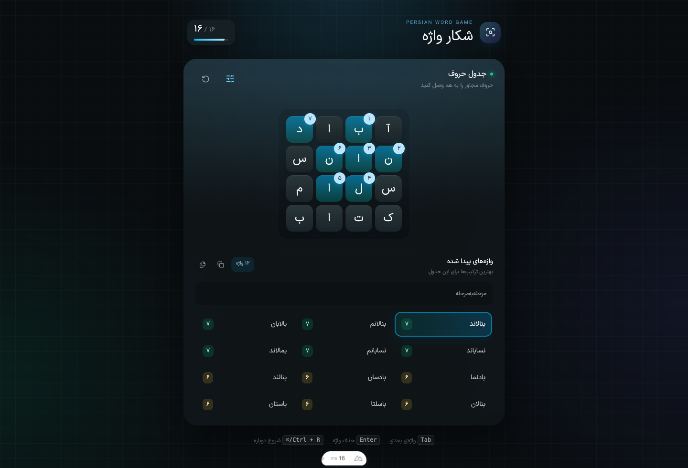
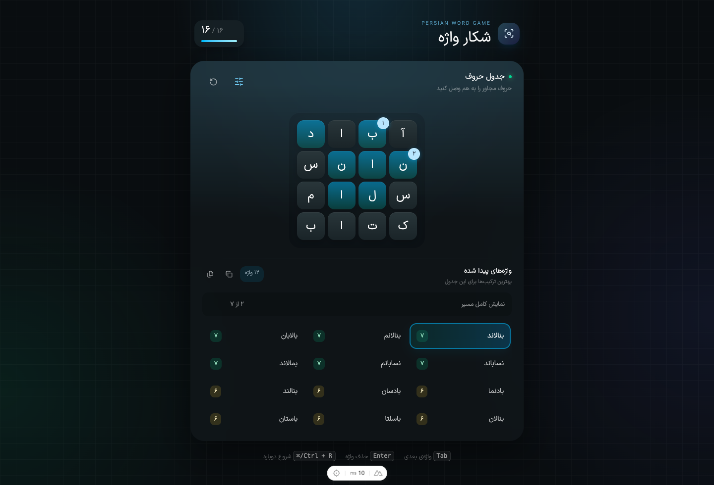

# شکار واژه

**شکار واژه** یک حل‌کنندهٔ فارسی برای جدول‌های سبک Boggle است؛ نه خود بازی. شما حروف یک جدول را وارد می‌کنید و ابزار واژه‌های معتبرِ قابل ساخت را، همراه با مسیر دقیق هر واژه، پیدا می‌کند.

این ابزار برای زمانی مناسب است که جدول یک بازی، مسابقه یا معمای واژه را در اختیار دارید و می‌خواهید سریع و دقیق همهٔ پاسخ‌های ممکن را بررسی کنید.

[](https://nuxt.com)
[](https://vuejs.org)
[](https://www.typescriptlang.org)
[](https://unocss.dev)

## نمای برنامه

### نتایج و مسیر کامل واژه



### بررسی مسیر به‌صورت مرحله‌ای



## قابلیت‌ها

- جست‌وجوی واژه‌های فارسی در یک جدول مستطیلی ۲×۲ تا ۵×۵
- واژه‌نامهٔ داخلی با بیش از ۱۰۰٬۰۰۰ واژه
- الگوریتم سریع `Trie + DFS` با حذف زودهنگام مسیرهای نامعتبر
- اتصال حروف در هشت جهت: افقی، عمودی و قطری
- جلوگیری از استفادهٔ دوباره از یک خانه در یک واژه
- نمایش مسیر واژه روی جدول و شماره‌گذاری ترتیب حروف
- حالت «مرحله‌به‌مرحله» برای دیدن حرکت در مسیر یک واژه
- فیلتر حداقل و حداکثر طول واژه و مخفی‌کردن واژه‌های سه‌حرفی
- محدودکردن تعداد نتایج قابل نمایش
- کپی واژهٔ انتخاب‌شده یا کل فهرست نتایج
- پشتیبانی از کیبورد، فوکوس قابل مشاهده و صفحه‌خوان
- رابط واکنش‌گرا برای دسکتاپ و موبایل

## شروع سریع

### پیش‌نیازها

- Node.js 20 یا جدیدتر
- pnpm 9 یا جدیدتر

### نصب و اجرا

```bash
git clone https://github.com/Navidtm/wordGame.git
cd wordGame
pnpm install
pnpm dev
```

بعد از اجرا، آدرس نمایش‌داده‌شده در ترمینال را در مرورگر باز کنید؛ معمولاً `http://localhost:3000` است.

### ساخت نسخهٔ production

```bash
pnpm build
pnpm preview
```

## روش استفاده

1. در بخش «جدول حروف»، حروف جدول را وارد کنید. با واردکردن هر حرف، فوکوس به خانهٔ خالی بعدی می‌رود.
2. بعد از کامل‌شدن جدول، اولین واژهٔ پیدا‌شده به‌صورت خودکار انتخاب می‌شود.
3. با `Tab` بین واژه‌ها حرکت کنید. مسیر و شمارهٔ ترتیب حروف واژهٔ فوکوس‌شده روی جدول نمایش داده می‌شود.
4. برای دیدن مسیر خانه‌به‌خانه، روی «مرحله‌به‌مرحله» بزنید و با دکمه‌های جهت‌دار حرکت کنید.
5. در تنظیمات، ابعاد جدول، تعداد نتایج و بازهٔ طول واژه‌ها را تنظیم کنید.
6. از آیکن‌های کپی در بخش نتایج برای کپی واژهٔ انتخاب‌شده یا همهٔ واژه‌ها استفاده کنید.

> با انتخاب دوبارهٔ یک واژه یا فشردن `Enter` روی آن، حروف همان مسیر از جدول پاک می‌شوند؛ برای بازگرداندن پاک‌سازی کامل جدول، از دکمهٔ «بازگردانی» استفاده کنید.

## میانبرهای کیبورد

| میانبر | عملکرد |
| --- | --- |
| `Tab` | رفتن به واژهٔ بعدی و نمایش مسیر آن |
| `Enter` | تأیید واژهٔ فوکوس‌شده و پاک‌کردن مسیر آن |
| `Ctrl/⌘ + R` | پاک‌کردن کامل جدول |
| `Esc` | بستن پنل تنظیمات |

## تنظیمات جست‌وجو

پنل تنظیمات این امکان‌ها را در اختیارتان می‌گذارد:

- **تعداد واژه‌ها:** سقف نمایش نتایج را تعیین می‌کند.
- **طول واژه:** فقط واژه‌هایی در بازهٔ حداقل تا حداکثر انتخاب‌شده نمایش داده می‌شوند.
- **مخفی‌کردن واژه‌های سه‌حرفی:** برای تمرکز روی پاسخ‌های بلندتر.
- **اندازهٔ جدول:** تعداد ستون و ردیف جدول را بین ۲ تا ۵ تغییر می‌دهد.

## منطق جست‌وجو

واژه‌نامه در یک Trie بارگذاری می‌شود. جست‌وجو از هر خانه شروع می‌شود و با پیمایش عمقی خانه‌های مجاور ادامه پیدا می‌کند. هر بار که پیشوندِ ساخته‌شده در Trie وجود نداشته باشد، همان مسیر فوراً کنار گذاشته می‌شود. این کار باعث می‌شود جست‌وجو حتی در جدول‌های بزرگ سریع باقی بماند.

برای هر واژهٔ پیدا‌شده، مسیر خانه‌ها نیز ذخیره می‌شود؛ بنابراین رابط کاربری می‌تواند هم مسیر کامل و هم مراحل آن را نمایش دهد.

## اسکریپت‌ها

| دستور | توضیح |
| --- | --- |
| `pnpm dev` | اجرای محیط توسعه |
| `pnpm build` | ساخت نسخهٔ production |
| `pnpm preview` | پیش‌نمایش نسخهٔ production |
| `pnpm test` | اجرای تست‌های واحد |
| `pnpm typecheck` | بررسی TypeScript و قالب‌های Vue |

## ساختار پروژه

```text
app/
├── components/       # جدول حروف، نتایج و تنظیمات
├── data/             # واژه‌نامهٔ فارسی
├── pages/            # صفحهٔ اصلی ابزار
├── utils/            # Trie، جست‌وجوی DFS و امتیازدهی
└── assets/css/       # استایل‌های سراسری
test/unit/            # تست‌های الگوریتم جست‌وجو
public/screenshots/   # تصاویر README
```

## توسعه

پروژه از TypeScript و تست‌های Vitest استفاده می‌کند. پیش از ارسال تغییرات، این دستور را اجرا کنید:

```bash
pnpm typecheck && pnpm test && pnpm build
```

## مجوز

این پروژه در حال حاضر فایل مجوز مستقلی ندارد. پیش از استفاده یا انتشار مجدد، با مالک مخزن هماهنگ کنید.
